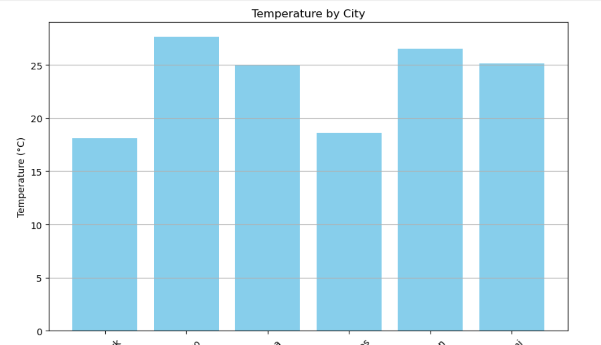
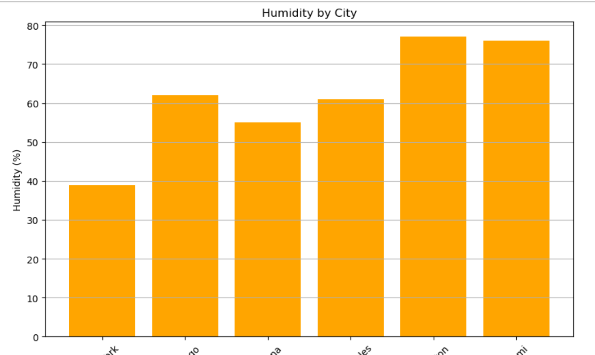

# 📈 Weather ETL & Visualization Project

This project demonstrates a complete ETL (Extract, Transform, Load) pipeline and visualization using live weather data for multiple U.S. cities.

---

## 🛠 Project Overview

**Extract**  
- Fetches current weather data from the [OpenWeatherMap API](https://openweathermap.org/api) for cities: New York, Chicago, Indiana, Los Angeles, Houston, Miami.

**Transform**  
- Cleans and simplifies the JSON payload into key fields:
  - `city`, `country`
  - `temperature` (°C), `feels_like` (°C)
  - `humidity` (%)
  - `description` (weather condition)
  - `wind_speed` (m/s)

**Load**  
- Inserts the transformed records into a **MySQL** database table (`weather_data`).

**Visualize**  
- Reads the data from MySQL via **SQLAlchemy** into a **Pandas** DataFrame and produces bar charts.

---

## 📂 Files Included

- `weather_etl_analysis.ipynb` – Full Jupyter Notebook with ETL code, transformations, and visualizations.
- `requirements.txt` – List of Python dependencies.
- `images/` – Folder containing visualization screenshots.

---

## ⚙️ Setup Instructions

1. **Clone the Repository**

   ```bash
   git clone https://github.com/akunuru03/weather_etl_project.git
   cd weather_etl_project
   ```

2. **Install Required Packages**

   ```bash
   pip install -r requirements.txt
   ```

3. **MySQL Setup**

   Ensure MySQL server is running and create the database and table if not present:

   ```sql
   CREATE DATABASE IF NOT EXISTS weather_data_db;
   USE weather_data_db;
   CREATE TABLE IF NOT EXISTS weather_data (
       id INT AUTO_INCREMENT PRIMARY KEY,
       city VARCHAR(50),
       country VARCHAR(10),
       temperature FLOAT,
       feels_like FLOAT,
       humidity INT,
       description VARCHAR(100),
       wind_speed FLOAT,
       created_at TIMESTAMP DEFAULT CURRENT_TIMESTAMP
   );
   ```

   Also ensure the user has permissions:

   ```sql
   CREATE USER IF NOT EXISTS 'weather_user'@'localhost' IDENTIFIED BY 'WeatherPass123';
   GRANT ALL PRIVILEGES ON weather_data_db.* TO 'weather_user'@'localhost';
   FLUSH PRIVILEGES;
   ```

4. **Run the Notebook**

   - Launch Jupyter Lab or Notebook:
     ```bash
     jupyter lab
     ```
   - Open `weather_etl_analysis.ipynb` and execute all cells.

---

## 📊 Visualization

We visualize the collected weather data using bar charts for easy comparison. The charts below are shown side-by-side for better visual impact.

<div style="display: flex; justify-content: space-around;">

  

  

</div>


